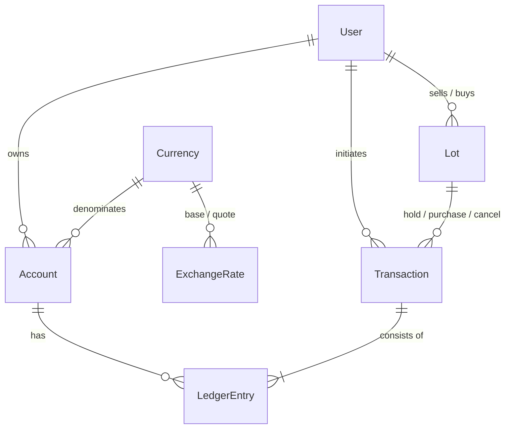

# Exchanger

A multi-currency wallet and peer-to-peer exchange platform built with Next.js, TypeScript and PostgreSQL.

Users hold balances in several fiat currencies and cryptocurrencies. They can convert money between their own accounts, send money to other users, and trade with each other through a simple order book of fixed-price offers ("lots").

> Status: work in progress. This README describes the planned scope.

## Features

### Accounts and balances

- Supported currencies:
  - Fiat: **USD**, **EUR**, **GBP**
  - Crypto: **BTC**, **ETH**
- Each user has one account per currency.
- Every newly registered user receives a **$100 USD welcome bonus**.

### Transfers and conversion

- **Convert between own accounts**: for example, USD → EUR at the current exchange rate.
- **Send money to another user**, with optional conversion: for example, send USD from your account and the recipient receives EUR.
- **Exchange rates** come from public APIs ([Frankfurter](https://frankfurter.dev) for fiat, [CoinGecko](https://www.coingecko.com/en/api) for crypto). They are cached in the database, so the app keeps working if an API is slow or unavailable.

### P2P marketplace (lots)

- A user creates a lot, for example: **"Sell 50 USD for 40 EUR"**.
- The lot's amount is reserved (held) on the seller's account until it is bought or cancelled.
- Other users browse open lots and can **buy** one if the offer is better than the market rate.
- The seller can cancel an open lot, which releases the held funds.
- Lot statuses: `open` → `filled` / `cancelled`.

### Profile

- Balances for every currency.
- Transaction history.
- **Deposit** and **Withdraw** options are shown in the profile but are **not functional**, because no payment provider (Stripe, etc.) is connected. They are UI placeholders only.

### Admin panel

- **Users**: list, search and view details.
- **Accounts**: all accounts with their balances.
- **Transactions**: full transaction log with filters (type, user, currency, date).

## Tech stack

| Layer      | Technology                        |
| ---------- | --------------------------------- |
| Framework  | Next.js (App Router), React       |
| Language   | TypeScript                        |
| Database   | PostgreSQL                        |
| ORM        | Prisma                            |
| Auth       | Database sessions, Server Actions |
| Styling    | Tailwind CSS                      |
| Validation | Zod                               |
| Testing    | Vitest, Playwright                |
| Infra      | Docker Compose (Postgres)         |

## Design principles

- **Double-entry ledger**: every money movement is a transaction made of ledger entries, and each transaction's entries sum to zero per currency. Account balances are derived from the ledger.
- **Exact money arithmetic**: amounts are stored as `NUMERIC(36, 18)`, never floating point. Each currency has its own precision (2 decimal places for fiat, 8 for BTC, 18 for ETH).
- **Atomic operations**: transfers, conversions and lot purchases each run inside a single database transaction with row-level locking, so balances can't go negative and one lot can't be bought twice.
- **Idempotency**: operations that change money accept an idempotency key, so a retried request can't be applied twice.
- **Auditability**: transactions are append-only; corrections are made with new, offsetting transactions.
- **Integrity in the database**: the rules above are enforced by PostgreSQL itself, not only by application code. See [Database integrity](#database-integrity).

## Data model



| Table            | Purpose                                                                                                                     |
| ---------------- | --------------------------------------------------------------------------------------------------------------------------- |
| `users`          | Email, password hash (scrypt), role (`USER` / `ADMIN`)                                                                      |
| `sessions`       | Login sessions: SHA-256 hash of the cookie token, user, expiry, user agent                                                  |
| `currencies`     | Code, name, symbol, type (`FIAT` / `CRYPTO`), precision                                                                     |
| `accounts`       | One `USER` account per user per currency, plus one `TREASURY` and one `ESCROW` system account per currency                  |
| `transactions`   | One business operation: type, initiator, idempotency key, related lot, metadata (e.g. the rate used)                        |
| `ledger_entries` | Signed amount posted to one account. Positive credits, negative debits                                                      |
| `lots`           | P2P offers: sell currency and amount, buy currency and amount, status (`OPEN` / `FILLED` / `CANCELLED`)                     |
| `exchange_rates` | Rate history: 1 unit of the base currency equals `rate` units of the quote currency. Source: Frankfurter, CoinGecko or seed |

### System accounts

Money never appears or disappears; it moves between accounts.

- **Treasury** (one per currency) is the platform's own account. It funds welcome bonuses and is the counterparty of conversions. It is the only account allowed to go negative: its negative balance is the amount the platform has issued.
- **Escrow** (one per currency) holds funds reserved by open lots.

Examples:

| Operation                      | Ledger entries                                                         |
| ------------------------------ | ---------------------------------------------------------------------- |
| Welcome bonus                  | User USD `+100`, Treasury USD `-100`                                   |
| Convert 50 USD to 43 EUR       | User USD `-50`, Treasury USD `+50`, Treasury EUR `-43`, User EUR `+43` |
| Create lot "50 USD for 40 EUR" | Seller USD `-50`, Escrow USD `+50`                                     |
| Buy that lot                   | Escrow USD `-50`, Buyer USD `+50`, Buyer EUR `-40`, Seller EUR `+40`   |

## Database integrity

Implemented in [`prisma/migrations/*_ledger_integrity`](prisma/migrations), because Prisma can't express these rules in `schema.prisma`:

| Rule                                             | Mechanism                                                                                  |
| ------------------------------------------------ | ------------------------------------------------------------------------------------------ |
| Balances always match the ledger                 | `AFTER INSERT` trigger on `ledger_entries` updates `accounts.balance`                      |
| Balances can't be edited directly                | `BEFORE UPDATE` trigger on `accounts` (allowed only from the ledger trigger)               |
| User and escrow accounts can't go negative       | `CHECK` constraint; the balance `UPDATE` also locks the row, serializing concurrent spends |
| Every transaction balances per currency          | `DEFERRABLE INITIALLY DEFERRED` constraint trigger, checked at `COMMIT`                    |
| Amounts respect currency precision               | Checked in the ledger trigger (e.g. no `0.001 USD`)                                        |
| Ledger and transactions are append-only          | `BEFORE UPDATE OR DELETE` triggers                                                         |
| One treasury and one escrow account per currency | Partial unique index `WHERE user_id IS NULL`                                               |
| Lot state is consistent                          | `CHECK`: an open lot has no buyer, a filled lot has a buyer, etc.                          |
| Idempotency keys are unique per user             | Unique index on `(initiated_by_id, idempotency_key)`                                       |

Reconciliation: the `account_balance_mismatches` view lists accounts whose stored balance differs from the sum of their ledger entries. It must always be empty.

```sql
SELECT * FROM account_balance_mismatches;
```

## Authentication

Email and password auth built on the [Next.js authentication guide](https://nextjs.org/docs/app/guides/authentication), without an auth library:

- **Sign-up** runs in one database transaction: it creates the user, one account per currency, and posts the $100 welcome bonus from the treasury through the ledger. The bonus uses a per-user idempotency key, so it can never be credited twice.
- **Passwords** are hashed with scrypt (Node's built-in `crypto`). Login returns the same error for an unknown email and a wrong password, and verifies against a dummy hash when the email is unknown, so response time doesn't reveal registered emails.
- **Sessions** are stored in PostgreSQL. The browser gets a random 256-bit token in an `httpOnly`, `SameSite=Lax` cookie (`Secure` in production); the database stores only its SHA-256 hash. Logging out deletes the session row, so a copied cookie stops working immediately.
- **Authorization**: `src/proxy.ts` redirects visitors without a session cookie away from protected pages (an optimistic check, no database access). Pages and Server Actions verify the session against the database through `getCurrentUser()` / `requireUser()` in `src/server/auth.ts`.
- **Redirect after login** accepts only local paths, which prevents open redirects (e.g. `?next=//evil.com`).
- **CSRF**: Server Actions accept only `POST` requests from the same origin.

## Roadmap

- [x] Project setup: Next.js, TypeScript, Tailwind, Prisma, Docker Compose with Postgres
- [x] Database schema, migrations, seed data (currencies, admin user)
- [x] Authentication: registration and login, automatic account creation, $100 welcome bonus
- [ ] Profile: balances, transaction history, Deposit/Withdraw placeholders
- [ ] Exchange rates and conversion between own accounts
- [ ] Transfers to other users
- [ ] P2P marketplace: create, browse, buy and cancel lots
- [ ] Admin panel: users, accounts, transactions
- [ ] Tests (unit tests and end-to-end tests) and CI

## Getting started

### Requirements

- Node.js 20.9 or newer
- PostgreSQL 14 or newer: either local, or started with Docker Compose

### Setup

```bash
# 1. Install dependencies (this also generates the Prisma client)
npm install

# 2. Configure the environment
cp .env.example .env

# 3. Start PostgreSQL (skip if you use a local instance and have updated DATABASE_URL)
npm run db:up

# 4. Apply database migrations
npm run db:migrate

# 5. Seed reference data: currencies, system accounts, fallback rates, admin user
npm run db:seed

# 6. Start the dev server
npm run dev
```

The app runs at http://localhost:3000. The health check at http://localhost:3000/api/health confirms that the app can reach the database.

The seed creates an admin user from `ADMIN_EMAIL` and `ADMIN_PASSWORD`. If `ADMIN_PASSWORD` is empty, a random password is generated and printed once. The seed is safe to run repeatedly.

### Scripts

| Script               | Description                                         |
| -------------------- | --------------------------------------------------- |
| `npm run dev`        | Start the development server                        |
| `npm run build`      | Build for production                                |
| `npm run lint`       | Run ESLint                                          |
| `npm run typecheck`  | Type-check with the TypeScript compiler             |
| `npm run format`     | Format code with Prettier                           |
| `npm run db:up`      | Start PostgreSQL with Docker Compose                |
| `npm run db:migrate` | Create and apply migrations (dev)                   |
| `npm run db:deploy`  | Apply migrations (production)                       |
| `npm run db:seed`    | Seed reference data                                 |
| `npm run db:reset`   | Drop the dev database, re-apply migrations and seed |
| `npm run db:studio`  | Open Prisma Studio                                  |

## Project structure

```
prisma/
  schema.prisma        Database schema
  migrations/          SQL migrations, including integrity triggers and constraints
  seed.ts              Reference data seed
src/
  app/                 Next.js App Router pages, Server Actions and route handlers
    (auth)/            Sign-up, login and logout
    profile/           User profile with balances
    api/health/        Health check endpoint
  components/          Shared React components
  lib/                 Code shared by server and client
    currencies.ts      Supported currencies and welcome bonus
    db.ts              Prisma client singleton
    env.ts             Validated environment variables
    money.ts           Precise amount formatting
    password.ts        Password hashing (scrypt)
    validation/        Zod schemas for forms
  server/              Server-only business logic
    auth.ts            Sessions, current user
    ledger.ts          Posting transactions to the ledger
    users.ts           Registration and credential checks
    accounts.ts        Balances
  proxy.ts             Optimistic redirect for protected pages
  generated/prisma/    Generated Prisma client (git-ignored)
```
